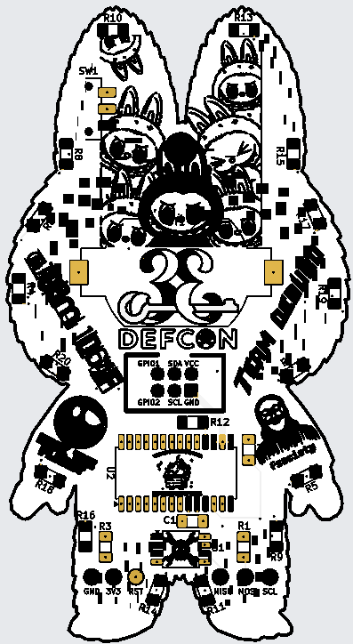

# DC33-LaBubu

## JLCPCB PCB Colors & Components
- ENIG Copper
- White Silk
- Mask
    * Red
    * Blue
    * Purple
    * Green 
    * Yellow
    * White
    * Black
- Components
    * 1206 SMD LEDs HandSoldering
    * 1206 SMD Resistors HandSoldering
    * 1206 SMD Capacitor HandSoldering
    * Attiny85
    * MCP23017
    * CR2032 Battery Holder
    * Switch
    * SAO Connector

 
 
 
 
 
 

 

